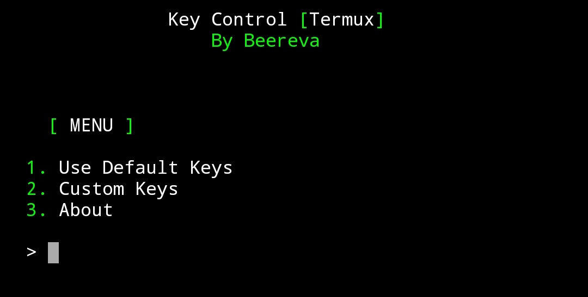

# Terkey
Is a tool for add keys to your Termux app.

## Cara Penginstalan

* `$ pkg update && pkg upgrade`
* `$ pkg install python`
* `$ pkg install git`
* `$ git clone https://github.com/beereva/key-control`
* `$ cd key-control`
* `$ python key-control.py`


Atau Anda bisa menyalin kode di bawah ini dan menempelkannya ke aplikasi Termux Anda dan tentu saja, tekan enter!

```pkg update && pkg upgrade;pkg install python git;git clone https://github.com/beereva/key-control;cd key-control;python key-control.py```

## Cara Penggunaan?
Dalam pembaruan terbaru, saya membuat alat ini dengan antarmuka yang ramah pengguna, sehingga Anda dapat mengikuti menu.

## Fitur Yang Tersedia !
Seperti yang Anda lihat di inage di atas, Terkey memiliki 3 menu,
1. Use Default Keys
2. Custom Keys
3. About

#### 1. Default Keys
Jika Anda memilih opsi ini, program akan membuat
`ESC,/,-,HOME,UP,END,PGUP,TAB,CTRL,ALT,LEFT,DOWN,RIGHT,PGDN`
sebagai kunci Termux Anda.

#### 2. Custom keys
Ya, dalam pembaruan terbaru, saya menambahkan fitur yang berguna ini. Anda dapat menyesuaikan kunci Anda sendiri.
Anda hanya memisahkan kunci Anda dengan koma, seperti `ESC,CTRL,HOME,UP,RIGHT,{,},(,)` etc.
Semua kunci Termux tersedia di sini [Termux Wiki](https://wiki.termux.com/wiki/Touch_Keyboard)

#### 3. About
Hmm.. menu ini hanya berisi sedikit omong kosong tentang alat ini dan saya
> Hei, jika menurut Anda ini sangat berguna, tolong beri saya bintang!
> Terima kasih!

## Author
Begitu banyak informasi tentang saya di internet, ketik saja ['Beereva'](https://t.me/Beereva) in your browser !
